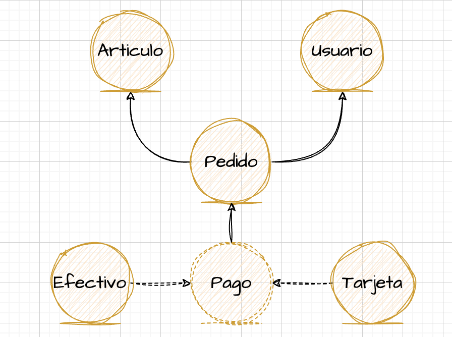
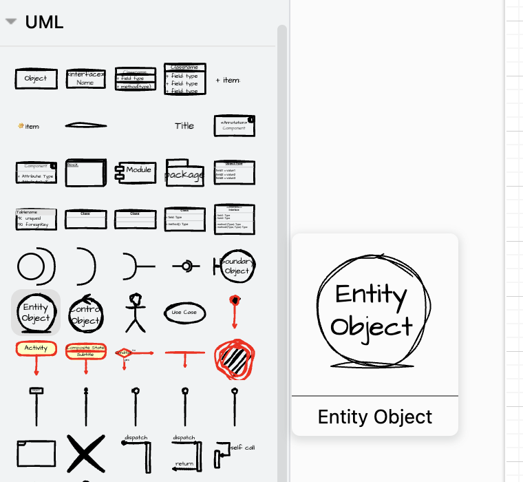
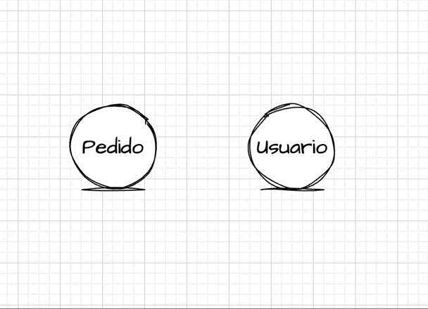
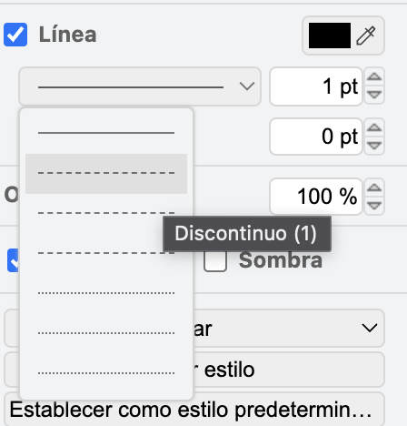
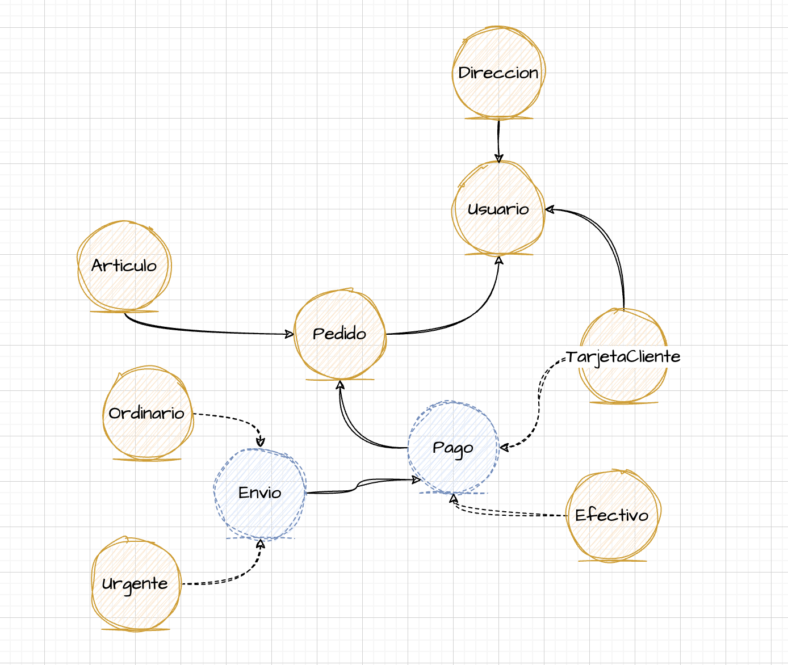

# IOMapper

IOMapper es una pequeña herramienta para traducir los diagramas de entidades hechos en *draw.io* a código Java.

## Consideraciones
IOMapper no pretende ser un gran software altamente genérico y customizable de cara a una gran comunidad sino que se trata únicamente de una pequeña utilidad fuertemente ajustada a mi forma concreta de trabajar. Tampoco implementa un gran abanico de detección de errores como nombres de entidades duplicados, siendo estos responsabilidad del desarrollador. No es más que una sencillísima heramienta para agilizar el primer arranque de un proyecto. Cualquier persona es libre de usar total o parcialmente este código para adaptarlo a sus necesidades o mejorarlo.

## Instalación y uso
Versión de Python: 3.11.6
1. Instalar las dependencias:
```
pip install -r requeriments.txt
```

2. Ejecutar el fichero de ejemplo
```
python iomapper.py example/ejemplo.drawio
```

Se generará un directorio *output* con las clases Java.

## Ejemplo

Para el siguiente ejemplo se utilizará un pequeño diagrama que podría representar parte del modelo de datos de un negocio de venta.



Dado este diagrama, veamos las clases que genera IOMapper:


#### UML Entity
Un objeto de tipo *UML Entity* como *Usuario* se traduce en una entidad de Java:

```
@Entity
public class Usuario {
    
    private Long id;
        
    protected Usuario() {}
    
    @Id
    @GeneratedValue(strategy = GenerationType.AUTO)
    public Long getId() { return this.id; }

    public void setId(Long id) { this.id = id; }
}
```


#### Flecha continua
Una flecha continua que apunta de una entidad a otra simboliza una relación muchos a uno, donde el hijo apunta a su padre. Por ejemplo, la entidad *Pedido* quedaría de la siguiente manera:

```
@Entity
public class Pedido {
    
    private Long id;
        
    private Usuario usuario;
    
    private Articulo articulo;
    

    protected Pedido() {}
    
    @Id
    @GeneratedValue(strategy = GenerationType.AUTO)
    public Long getId() { return this.id; }

    public void setId(Long id) { this.id = id; }
        
    @ManyToOne()
    @JoinColumn(name = "ID_USUARIO")
    public Usuario getUsuario() { return this.usuario; }

    public void setUsuario(Usuario usuario) { this.usuario = usuario; }
    
    @ManyToOne()
    @JoinColumn(name = "ID_ARTICULO")
    public Articulo getArticulo() { return this.articulo; }

    public void setArticulo(Articulo articulo) { this.articulo = articulo; }
    
}
```

#### UML Entity con línea discontinua
Un objeto *UML Entity* con línea discontinua es traducido como una entidad abstracta. También y sin estar relacionado con lo primero, una entidad que sea base de otras será anotada con *@Inheritance*. Así, la entidad *Pago* produciría:

```
@Entity
@Inheritance(strategy = InheritanceType.JOINED)
public abstract class Pago {
    
    private Long id;
        
    private Pedido pedido;

    protected Pago() {}
    
    @Id
    @GeneratedValue(strategy = GenerationType.AUTO)
    public Long getId() { return this.id; }

    public void setId(Long id) { this.id = id; }
        
    @ManyToOne()
    @JoinColumn(name = "ID_PEDIDO")
    public Pedido getPedido() { return this.pedido; }

    public void setPedido(Pedido pedido) { this.pedido = pedido; }
    
}
```

#### Flecha discontinua
Una flecha discontinua de una entidad a otra simboliza una relación de herencia, donde la clase derivada apunta a la clase base. Por ejemplo, la entidad *Tarjeta* produciría el siguiente código:

```
@Entity
public class Tarjeta extends Pago {

    protected Tarjeta() {}    

}
```

#### Cabeceras
Las clases generadas contendrán la cabecera:
```
package iomapper;

import javax.persistence.*;
```

De esta forma las anotaciones funcionarán corectamente y el nombre del paquete será fácil de localizar y reemplazar en todas las clases utilizando la herramienta de reemplazo de cualquier editor.

### Uso de Draw.io

Es importante utilizar *Draw.io* siguiendo las siguientes consideraciones para que *IOMapper* funcione correctamente:

1. Las entidades son los objetos *Entity Object* dentro de la sección *UML*
   


2. Para poner el nombre a una entidad simplemente se hace doble click sobre la misma y se edita. No se deben usar cajas de texto. *IOMapper* usará estos nombres para las clases de Java, por lo que deben ponerse siguiendo la nomenclatura típica (primera letra en mayúscula)

3. Para crear una relación no se usarán terceros objetos de tipo flecha. Basta con aproximar el cursor al border de una entidad, hacer click y arrastrar hasta la entidad destino.
   


4. La línea discontinua a utilizar tanto para las entidades como las relaciones será la primera (tipo 1) de todos los tipos disponibles.
   


5. Siempre que se respeten estas normas básicas no hay limitación en cuanto al resto de uso de estilos como colores, tamaños, temas, etc...


#### Nota importante

En ocasiones *Draw.io* exporta por defecto el diagrama en formato comprimido. En dicho caso *IOMapper* no funcionará y no creará las clases de Java. Esto también puede comprobarse fácilmente abriendo el fichero del diagrama y observando que en lugar de un *XML* válido contiene una gigante cadena de caracteres. Para asegurarse de exportar el diagrama como un *XML* válido que *IOMapper* pueda entender se puede hacer explícitamente haciendo click en *Archivo* -> *Exportar como* -> *XML...* y asegurarse de desmarcar la casilla *Comprimido*.


### Ejemplo

Como ejemplo final, se evoluciona un poco más el diagrama del tutorial (puede encontrarse el fichero *drawio* en el directorio *example*). A continuación se muestra el diagrama y el resultado final:



Cabe recordar que la salida consistiría en múltiples ficheros de clase, pero aquí se une en un solo bloque de código para simplificar su lectura:

```
package iomapper;

import javax.persistence.*;

@Entity
public class Articulo {
    
    private Long id;
        
    private Pedido pedido;
    
    protected Articulo() {}
    
    @Id
    @GeneratedValue(strategy = GenerationType.AUTO)
    public Long getId() { return this.id; }

    public void setId(Long id) { this.id = id; }
        
    @ManyToOne()
    @JoinColumn(name = "ID_PEDIDO")
    public Pedido getPedido() { return this.pedido; }

    public void setPedido(Pedido pedido) { this.pedido = pedido; }
}


@Entity
public class Direccion {
    
    private Long id;
        
    private Usuario usuario;
    
    protected Direccion() {}
    
    @Id
    @GeneratedValue(strategy = GenerationType.AUTO)
    public Long getId() { return this.id; }

    public void setId(Long id) { this.id = id; }
        
    @ManyToOne()
    @JoinColumn(name = "ID_USUARIO")
    public Usuario getUsuario() { return this.usuario; }

    public void setUsuario(Usuario usuario) { this.usuario = usuario; }
}


@Entity
public class Efectivo extends Pago {

    protected Efectivo() {}
}


@Entity
@Inheritance(strategy = InheritanceType.JOINED)
public abstract class Envio {
    
    private Long id;
        
    private Pago pago;
    
    protected Envio() {}
    
    @Id
    @GeneratedValue(strategy = GenerationType.AUTO)
    public Long getId() { return this.id; }

    public void setId(Long id) { this.id = id; }
        
    @ManyToOne()
    @JoinColumn(name = "ID_PAGO")
    public Pago getPago() { return this.pago; }

    public void setPago(Pago pago) { this.pago = pago; }
}


@Entity
public class Ordinario extends Envio {
        
    protected Ordinario() {}
}


@Entity
@Inheritance(strategy = InheritanceType.JOINED)
public abstract class Pago {
    
    private Long id;
        
    private Pedido pedido;
    
    protected Pago() {}
    
    @Id
    @GeneratedValue(strategy = GenerationType.AUTO)
    public Long getId() { return this.id; }

    public void setId(Long id) { this.id = id; }
        
    @ManyToOne()
    @JoinColumn(name = "ID_PEDIDO")
    public Pedido getPedido() { return this.pedido; }

    public void setPedido(Pedido pedido) { this.pedido = pedido; }
}


@Entity
public class Pedido {
    
    private Long id;
        
    private Usuario usuario;
    
    private Articulo articulo;

    protected Pedido() {}
    
    @Id
    @GeneratedValue(strategy = GenerationType.AUTO)
    public Long getId() { return this.id; }

    public void setId(Long id) { this.id = id; }
        
    @ManyToOne()
    @JoinColumn(name = "ID_USUARIO")
    public Usuario getUsuario() { return this.usuario; }

    public void setUsuario(Usuario usuario) { this.usuario = usuario; }
    
    @ManyToOne()
    @JoinColumn(name = "ID_ARTICULO")
    public Articulo getArticulo() { return this.articulo; }

    public void setArticulo(Articulo articulo) { this.articulo = articulo; }
}


@Entity
public class TarjetaCliente extends Pago {
        
    private Usuario usuario;
    
    protected TarjetaCliente() {}
        
    @ManyToOne()
    @JoinColumn(name = "ID_USUARIO")
    public Usuario getUsuario() { return this.usuario; }

    public void setUsuario(Usuario usuario) { this.usuario = usuario; }
}


@Entity
public class Urgente extends Envio {
        
    protected Urgente() {} 
}


@Entity
public class Usuario {
    
    private Long id;
        
    protected Usuario() {}
    
    @Id
    @GeneratedValue(strategy = GenerationType.AUTO)
    public Long getId() { return this.id; }

    public void setId(Long id) { this.id = id; }
}
```

#### Generación de los DAO

IOMapper también generará el código de los DAOs, aunque únicamente sus interfaces. Esto es así para no forzar al programador a una implementación concreta de todo el abanico de posibles opciones. Al igual que ocurre con las entidades, IOMapper generará un fichero por cada DAO, siguiendo la nomenclatura `NombreEntidadDAO.java`. 

Todos los DAOs contarán como mínimo con los métodos *save*, *get* y *list*

```
public interface ArticuloDao {

    void saveOrUpdate(Articulo articulo);

    Articulo get(Long id);

    List<Articulo> list();
            
}
```
Si la entidad apunta a otras entidades, como es el caso, por ejemplo, de *Pedido*, IOMapper generará en el DAO también un método *find* para cada uno de los atributos de la clase.

```
public interface PedidoDao {

    void saveOrUpdate(Pedido pedido);

    Pedido get(Long id);

    List<Pedido> list();
    
    Optional<Pedido> findByUsuario(Usuario usuario);
    
    Optional<Pedido> findByArticulo(Articulo articulo);
            
}
```
