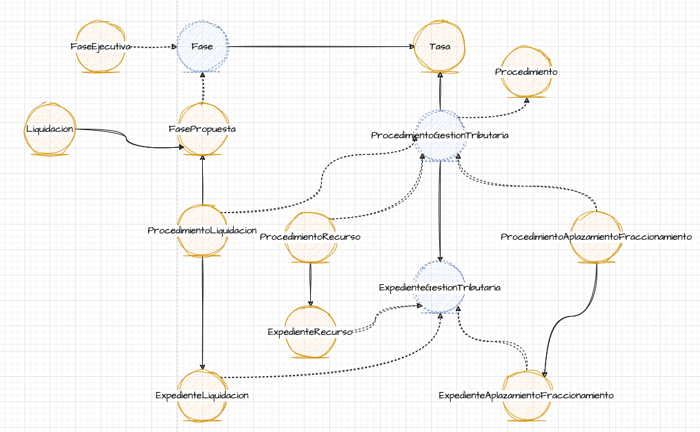

# IOMapper (versión Avantic)

IOMapper es una pequeña herramienta para traducir los diagramas de entidades hechos en *draw.io* a código Java.

## Consideraciones
IOMapper no pretende ser un gran software altamente genérico y customizable de cara a una gran comunidad sino que se trata únicamente de una pequeña utilidad fuertemente ajustada a mi forma concreta de trabajar. Tampoco implementa un gran abanico de detección de errores como nombres de entidades duplicados, siendo estos responsabilidad del desarrollador. No es más que una sencillísima heramienta para agilizar el primer arranque de un proyecto. Cualquier persona es libre de usar total o parcialmente este código para adaptarlo a sus necesidades o mejorarlo.

## Instalación y uso
Versión de Python: 3.11.6
1. Instalar las dependencias:
```
pip install -r requeriments.txt
```

2. Ejecutar el fichero de ejemplo
```
python iomapper.py example/ejemplo.drawio
```

Se generará un directorio *output* con las clases Java.

## Ejemplo

Para el siguiente ejemplo se utilizará un pequeño diagrama que podría representar parte del modelo de datos de un negocio de venta.


Dado este diagrama, hay varios elementos clave que IOMapper identificará y deben usarse correctamente para obtener el resultado deseado:

#### UML Entity
Un objeto de tipo *UML Entity* como *Usuario* se traduce en una entidad de Java:

#### Flecha continua
Una flecha continua que apunta de una entidad a otra simboliza una relación muchos a uno, donde el hijo apunta a su padre.

#### UML Entity con línea discontinua
Un objeto *UML Entity* con línea discontinua es traducido como una entidad abstracta.

#### Flecha discontinua
Una flecha discontinua de una entidad a otra simboliza una relación de herencia, donde la clase derivada apunta a la clase base.

### Uso de Draw.io

Es importante utilizar *Draw.io* siguiendo las siguientes consideraciones para que *IOMapper* funcione correctamente:

1. Las entidades son los objetos *Entity Object* dentro de la sección *UML*
   


2. Para poner el nombre a una entidad simplemente se hace doble click sobre la misma y se edita. No se deben usar cajas de texto. *IOMapper* usará estos nombres para las clases de Java, por lo que deben ponerse siguiendo la nomenclatura típica (primera letra en mayúscula)

3. Para crear una relación no se usarán terceros objetos de tipo flecha. Basta con aproximar el cursor al border de una entidad, hacer click y arrastrar hasta la entidad destino.
   


4. La línea discontinua a utilizar tanto para las entidades como las relaciones será la primera (tipo 1) de todos los tipos disponibles.
   


5. Siempre que se respeten estas normas básicas no hay limitación en cuanto al resto de uso de estilos como colores, tamaños, temas, etc...


#### Nota importante

En ocasiones *Draw.io* exporta por defecto el diagrama en formato comprimido. En dicho caso *IOMapper* no funcionará y no creará las clases de Java. Esto también puede comprobarse fácilmente abriendo el fichero del diagrama y observando que en lugar de un *XML* válido contiene una gigante cadena de caracteres. Para asegurarse de exportar el diagrama como un *XML* válido que *IOMapper* pueda entender se puede hacer explícitamente haciendo click en *Archivo* -> *Exportar como* -> *XML...* y asegurarse de desmarcar la casilla *Comprimido*.


### Ejemplo real

A continuación se muestra un diagrama real utilizado por Avantic y el código generado por esta versión de IOMapper



IOMapper generará la siguiente estructura
```
output/
├─ dao/
│  ├─ impl
```

En cada directorio se encontrarán los ficheros de código correspondientes. A continuación se muestran algunos ejemplos:

#### Entidades

Una clase estándar generada por IOMapper. Nótese que hereda de `VersionedAuditEntity`

```
@AuditEntity("Tasa")
@Entity
@Table(name = "TASA")
public class Tasa extends VersionedAuditEntity {

    protected Tasa() {}
      
}
```

Ejemplo de anotaciones de auditoría en los atributos

```
@AuditEntity("Fase")
@Entity
@Table(name = "FASE")
@Inheritance(strategy = InheritanceType.JOINED)
public abstract class Fase extends VersionedAuditEntity {

    private Tasa tasa;
    
    protected Fase() {}
    
    @ManyToOne(fetch = FetchType.LAZY)
    @Cascade({})
    @JoinColumn(name = "idTasa", nullable = false)
    @AuditProperty(value = "tasa", auditStringFactoryClass = AuditEntityStringFactory.class)
    public Tasa getTasa() { return this.tasa; }

    public void setTasa(Tasa tasa) { this.tasa = tasa; }
    
}
```

Al extender de otra clase, ya no se extiende de `VersionedAuditEntity`. También se hace uso de la anotación `@PrimaryKeyJoinColumn` 

```
@AuditEntity("FaseEjecutiva")
@Entity
@Table(name = "FASE_EJECUTIVA")
@PrimaryKeyJoinColumn(name = "idFase")
public class FaseEjecutiva extends Fase {
 
    protected FaseEjecutiva() {}
    
}
```

#### Generación de los DAO

IOMapper también generará el código de los DAOs. Al igual que ocurre con las entidades, se generará un fichero por cada DAO, siguiendo la nomenclatura `NombreEntidadDAO.java`. 

Todos los DAOs contarán como mínimo con los métodos *save*, *get* y *list*

```
public interface ExpedienteRecursoDao {

    void saveOrUpdate(ExpedienteRecurso expedienteRecurso);

    ExpedienteRecurso get(Long id);

    List<ExpedienteRecurso> list();
    
}
```
Si la entidad apunta a otras entidades, como es el caso, por ejemplo, de *Fase*, IOMapper generará en el DAO también un método *list* para cada uno de los atributos de la clase.

```
public interface FaseDao {

    void saveOrUpdate(Fase fase);

    Fase get(Long id);

    List<Fase> list();
    
    List<Fase> listByTasa(Tasa tasa);
    
}
```

#### Implementación de los DAO

IOMapper generará también el código de la implementación de los DAOs

```
@Repository
public interface FaseDaoImpl extends AbstractDaoSupport implements FaseDao {

    @Override
    void saveOrUpdate(Fase fase) {
        getSession.saveOrUpdate(fase);
    }

    @Override
    Fase get(Long id) {
        return (Fase) getSession().get(Fase.class, id);
    }

    @Override
    @SuppressWarnings("unchecked")
    List<Fase> list() {
        return getSession().createCriteria(Fase.class)
                .addOrder(Order.desc("id"))
                .list();
    }

    @Override
    @SuppressWarnings("unchecked")
    List<Fase> listByTasa(Tasa tasa) {
        return getSession().createCriteria(Fase.class)
                .add(Restrictions.eq("tasa", tasa))
                .addOrder(Order.desc("id"))
                .list();
    }
    
}
```
